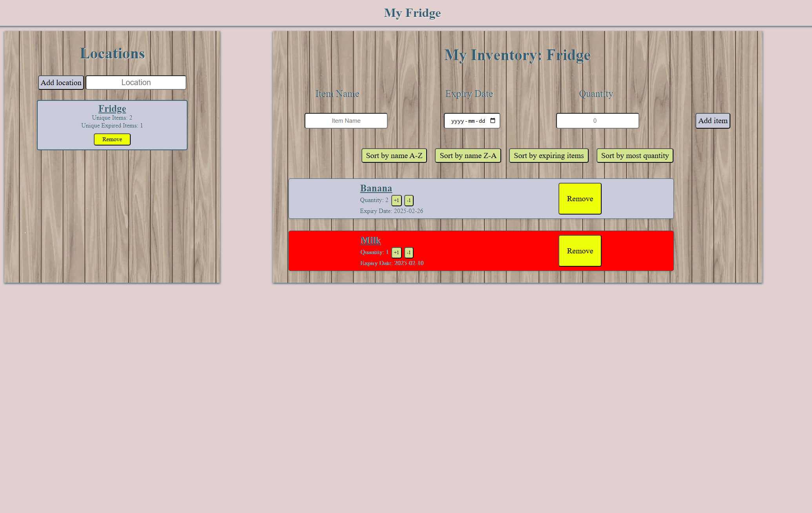

# First project
Website utilizing html, css and javascript frontend with a firebase database
A inventory manager that allows the user to track various locations and its items and highlights expired items

To get started:
1. Open the app in vscode
2. Download npm
3. In terminal type: npm install -g serve
4. In terminal type: serve .
5. Now you have your own inventory manager!

